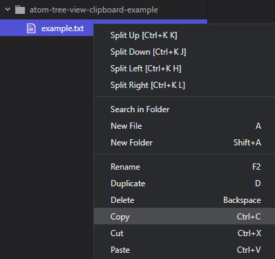
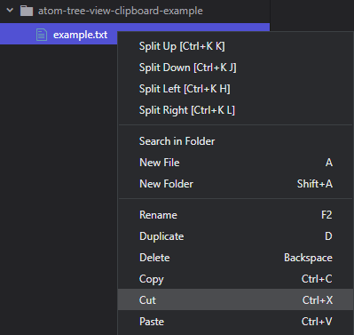
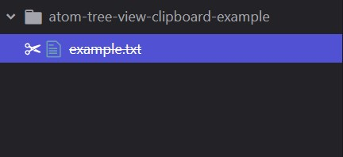
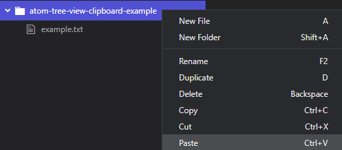
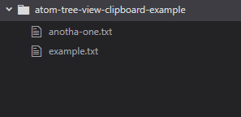

# tree-view-clipboard package

Add native-like Clipboard operations to the [tree-view](https://atom.io/packages/tree-view). This plugin allows you to copy, cut and paste folders and files via the [tree-view](https://atom.io/packages/tree-view) context menu and [keybindings](#keybindings).

## !Important

Currently this package only works for windows OS. If you know how to develop in MacOS or Linux, please consider contributing.

## Copy

You can copy tree-view selections by right-clicking them and clicking "Copy" in the context menu. The respective items will be placed on the clipboard, ready to be pasted anywhere.



## Cut

You can cut tree-view selections by right-clicking them and clicking "Cut" in the context menu. The respective item will be placed on the clipboard, ready to be pasted anywhere.



Cut items will be indicated by a scissor icon and line-through decorator.



## Paste

You can paste items by right-clicking in the tree-view and clicking "Paste" in the context menu.



This will paste the items from the clipboard into all selected folders in the tree-view.



## Keybindings

Override tree-view-clipboard keybindings in the `keymap.cson` file.

```
'.platform-win32 .tree-view':
    'ctrl-c': 'tree-view-clipboard:copy'
    'ctrl-x': 'tree-view-clipboard:cut'
    'ctrl-v': 'tree-view-clipboard:paste'

'tree-view':
    'ctrl-c': 'tree-view-clipboard:copy'
    'ctrl-x': 'tree-view-clipboard:cut'
    'ctrl-v': 'tree-view-clipboard:paste'
```
